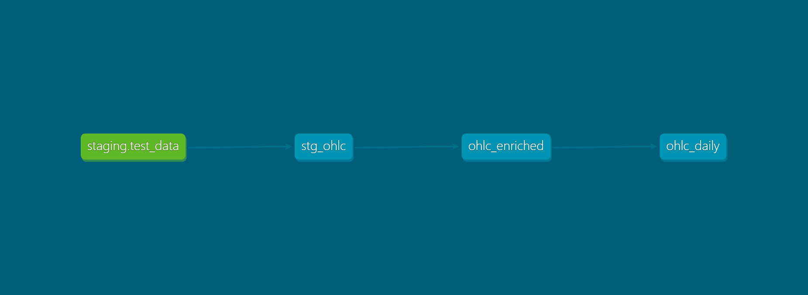
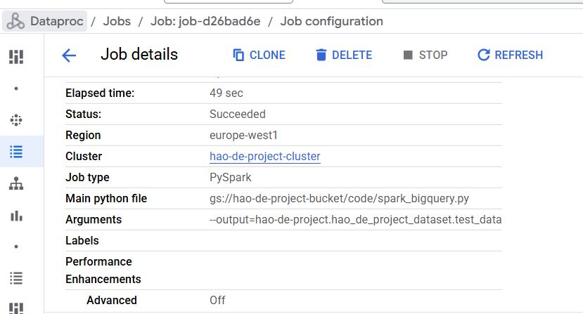

## Foreword
Thanks Data Engineering Zoomcamp and its community for providing this learning opporunity! 
Started the project near the end of April after knowing there will be another project submission opportunity, therefore have to keep the scope lean and simple in order to meet the deadline.
The original thoughts of the project were to leverge Kestra to build a E2E data pipeline with fully automated workflows. However, after some playing-around, I realize that the Kestra local version does not support many functions suggested by the ChatGPT whilst the cloud version would require paid license. Therefore, I have to pivot the whole project by using Pyspark whilst just running a simply workflow from my local machine. This consumed lots of time and efforts but hey, this is how the real world scenario looks like, isn't it.


## Project Overiew

### 1. Problem Description (below my own words, no ChatGPT!)
- Solana (SOL) is a popular cryptocurrency which is traded widely in the world. 
- However, there is very limited possibility to track its price (which is not true, but let's assume this is our problem) and visualize its price action. 
- This project is aimed to leverage open API (CoinGecko) to retrieve raw price data (OHLC) of Solana and then transform it in a way so that it can be used analytically.
- Finally by leveraging Google Looker Studio, result is presentd in a dashboard so that we can easily track the SOL price action in the last 30 days whilst checking its bullish/bearish momentum.

### 2. Terraform (cloud resources provision)
The Terraform scripts in the `1.Terraform/` directory are used to provision the necessary Google Cloud resources:
- **`main.tf`**: Defines resources such as a GCS bucket and a BigQuery dataset.
- **`variables.tf`**: Contains configurable variables for the project, such as project name, region, and dataset name.

### 3. Spark Data Retrieval (data ingestion per batch into DWH)
The `2.get_data_spark/` directory contains a Python script (`get_SOL_data`) that:
- Fetch Solana price via CoinGecko Rest API (https://api.coingecko.com/api/v3/coins/solana/ohlc?vs_currency=usd&days=30) as row data - 30 days OHLC (open, high, low, close) price data with 4 hour intervals. 
- Converts the data into a Pandas DataFrame and then a Spark DataFrame.
- Writes the data directly to BigQuery tables (data warehouse) via submit job with Dataproc.
- partitioning the raw data (BigQeury table) per day (timestamp)

### 3. dbt Data Transformation and Looker Studio Dashboarding 
The `3.data_transform_dbt/` directory contains dbt configurations and models for transforming the raw Solana OHLC data:
- **Staging Models**:
  - `stg_ohlc.sql`: Cleans and standardizes the raw data.
  - `schema.yml`: Defines metadata and tests for the staging model.
- **Core Models**:
  - `ohlc_enriched.sql`: Enriches the OHLC data with additional calculated attributes.
  - `ohlc_daily.sql`: Aggregates the data into daily OHLC values. (of course, this data can be also directly fetch with the CoinGecko API but we are doing this for the practice!)
  - `schema.yml`: Defines metadata and tests for the core models.
- **`dbt_project.yml`**: Configures the dbt project.
- **`packages.yml`**: Includes the `dbt_utils` package for additional functionality.
- Use `README.md` under the directory for further info.
- **Looker Stduio Dashboard**: the transformed datasets are perodically deployed to the prod directory in BigQuery which are then used to create SOL price dashbaord with [Google Looker Studio](https://lookerstudio.google.com/reporting/227ebf49-b651-44dc-b34b-099cd3abac20).    
- **Data Lineage**:
<p align="center">
  
</p>

### 4. Workflow Automation with Kestra
The `4.workflow_kestra/` directory contains a Kestra workflow (`job_submit.yaml`) that:
- Submits a PySpark job to a Dataproc cluster to fetch Solana OHLC data.
- Schedules the workflow to run on the 1st of every month at midnight (UTC).


## Workflow Overview

1. **Data Retrieval**:
   - The Spark script fetches Solana OHLC data from the CoinGecko API and writes it to BigQuery.
2. **Data Transformation**:
   - dbt models clean, enrich, and aggregate the data for analysis.
3. **Workflow Automation**:
   - Kestra orchestrates the data pipeline, ensuring timely execution and scheduling.
4. **Data Visualization**:
   - leverage Google Looker Studio to connect BigQuery and create visualization to make the SOl price anaylstic data visible to end users
 

## How to Run the Project (Reproducing the Codes)

### Prerequisites
- Google Cloud account with BigQuery, GCS, Compute Engine (VM) and Dataproc Cluster enabled.
- Terraform (runs on Docker/Docker-Compose) installed to the VM.
- Python and Spark environment (incl Java) set up.
- dbt installed with the required dependencies - this project runs on dbt cloud and connected with the BigQuery.
- Kestra installed on local machine for automated workflow execution to submit the Spark job.

### Steps
1. **Provision Resources**:
   - Use Terraform (IaC) to create the necessary GCP resources (run .tf in the VM):
     ```bash
     cd 1.Terraform
     terraform init
     terraform apply
     ```
2. **Fetch Data**:
   - Run the .py script (stored in GCS Bucket) to fetch and load data into BigQuery directory:
     ```bash
     python 2.get_data_spark/get_SOL_data --output=<project.dataset.table>
     ```
     In reality, submit job is used in Dataproc with argument provided to execute the python (PySpark) script. 
<p align="center">
    
</p>

3. **Transform Data**:
   - Run dbt to transform the data (using dbt cloud):
     ```bash
     cd 3.data_transform_dbt/hao-de-project_data
     dbt run
     ```
4. **Automate Workflow**:
   - Deploy the Kestra workflow to automate the pipeline (yaml file provided). 

5. **Data Visualization**:
   - Visit the public dashboard made by Looker Studio: https://lookerstudio.google.com/reporting/227ebf49-b651-44dc-b34b-099cd3abac20/page/tDQIF

<p align="center">
  
</p>

Thank YOU and feel free to connect with me via [LinkedIn](https://www.linkedin.com/in/hao-zheng-1b9aa098/)